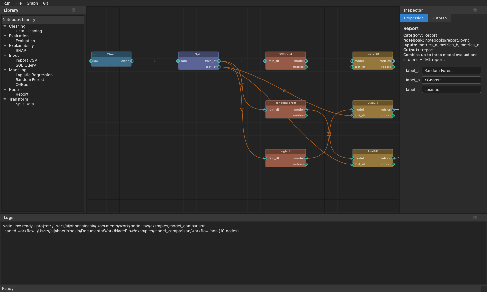

# NodeFlow

**A visual workflow tool for Jupyter notebooks.** Each node on the canvas is a notebook —
you wire notebooks together and NodeFlow runs them, passing data from one to the next. No file
paths, no glue code: write `inputs` / `outputs` in your notebook and connect the dots.


---

## What you get

- **Drag-and-drop canvas** — build ML/data pipelines visually (Blender-style nodes).
- **Nodes are notebooks** — executed with [Papermill]; edit them right in the app.
- **Smart caching** — only the nodes you changed re-run.
- **Built-in templates** — Import CSV, Clean, Split, Logistic Regression, Random Forest,
  XGBoost, SHAP, Evaluation, Report.
- **Output previews** — tables, charts, metrics and HTML reports inside the app.
-  **Major nodes** — group nodes into a reusable container you can expand.
- **Git built in** — commit, push, pull from the menu.

---

## Install

You need **Python 3.11+** and **Git**. Then:

### 1. Get the code
```bash
git clone https://github.com/aclcsn/nodeflow.git
cd nodeflow
```

### 2. Create a virtual environment

**macOS / Linux**
```bash
python3 -m venv .venv
source .venv/bin/activate
```

**Windows (PowerShell)**
```powershell
py -3 -m venv .venv
.venv\Scripts\Activate.ps1
```

### 3. Install NodeFlow
```bash
pip install --upgrade pip
pip install -e ".[gui,dev]"
```

### 4. Register the notebook kernel  *(don't skip this!)*
Each node runs in a Jupyter kernel that must find NodeFlow. With the venv **active**, run:
```bash
python -m ipykernel install --sys-prefix --name nodeflow --display-name "NodeFlow (venv)"
```

### 5. Check it works
```bash
nodeflow --version
```

---

## Launch

```bash
nodeflow
```

---

## Getting started

### Pick a workflow
When NodeFlow opens, choose a saved workflow, start a **New Blank Workflow**, or **Browse…**.


### The window
After opening, you'll see four areas:



| Area | What it's for |
|------|---------------|
| **Library** (left) | Available node templates, grouped by category. |
| **Canvas** (center) | Your workflow — the nodes and their connections. |
| **Inspector** (right) | A selected node's **Properties** (parameters) and **Outputs** (previews). |
| **Logs** (bottom) | What's happening as you build and run. |

### Build a workflow in 5 steps
1. **Add a node** — double-click a template in the **Library** (e.g. *Import CSV*).
2. **Connect nodes** — drag from a node's **output** dot to another node's **input** dot.
   NodeFlow only allows matching types.
3. **Set parameters** — click a node, edit its values in the **Properties** tab.
4. **Run** — use the **Run** menu → *Run All* (only changed nodes re-run thanks to caching).
5. **See results** — click a node and open the **Outputs** tab to preview its table / chart / report.

Then **File ▸ Save Workflow** to keep your board.

---

## Handy features

### Edit a node's notebook
Right-click a node → **⋯ Edit Notebook…** (or **Node ▸ Edit Notebook…**). Saving makes a
**separate copy** for that node, so the original template stays untouched.

### Group nodes into a "major node"
Select two or more nodes → **Graph ▸ Group Selected into Major Node…**. They collapse into one
tidy node:


Right-click it → **⋯ Expand (Major Node)** to look inside and see the subnodes' outputs:


### Save to Git
Use the **Git** menu to *Commit*, *Push*, *Pull*, make a *Branch*, or view *History* — all on
your whole project.

---

## Where your stuff lives

| Path | Contents |
|------|----------|
| `workflow.json` | Your saved board (nodes, connections, parameters). |
| `notebooks/` | The notebooks behind your nodes. |
| `runs/` | Results from each run (auto-generated). |

[Papermill]: https://papermill.readthedocs.io/
