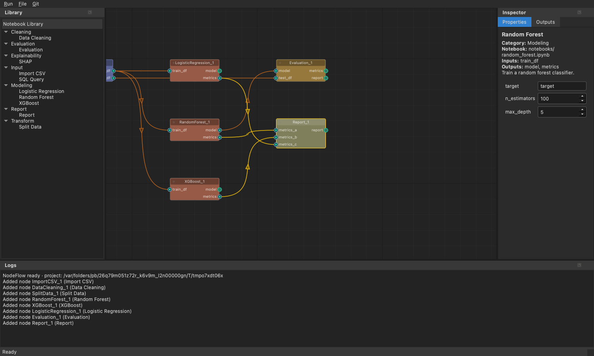
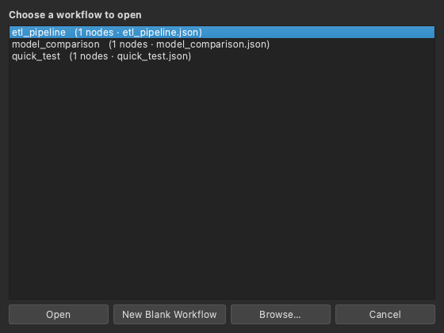
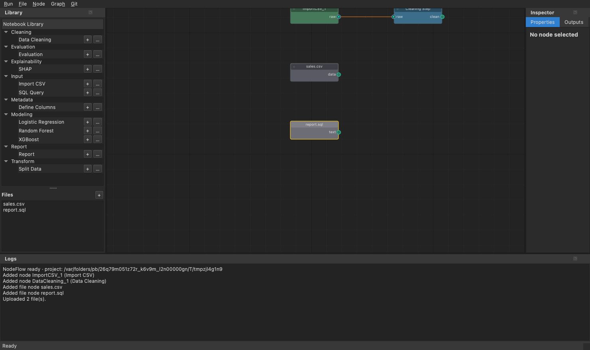
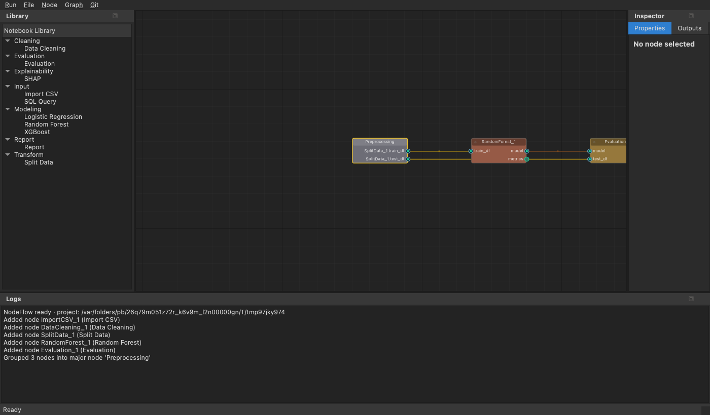
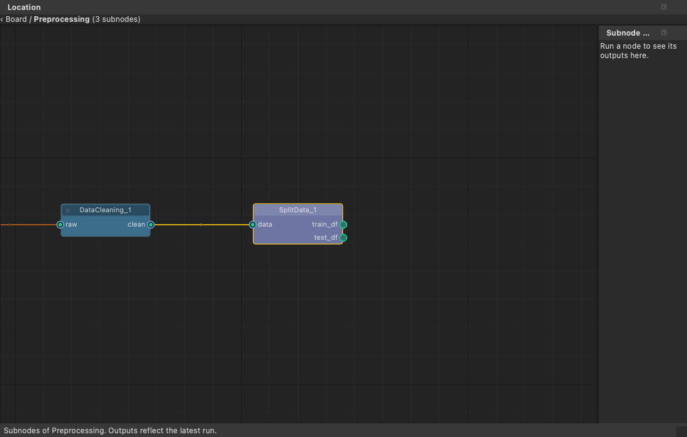

# NodeFlow

NodeFlow is a desktop application for building data and machine-learning workflows out of
Jupyter notebooks. Each node on the canvas is an instance of a notebook. You connect nodes to
describe how data flows between them, and NodeFlow runs the notebooks in order, supplying each
one with its inputs and storing its outputs. Notebooks exchange data through declared inputs and
outputs rather than reading and writing files directly.



---

## Overview

- **Visual canvas.** You assemble a workflow by adding nodes and connecting their ports.
- **Nodes are notebooks.** Each node runs a notebook with [Papermill]. Notebooks can be edited
  inside the application.
- **File inputs.** Upload CSV and SQL or text files; each becomes a source node you can wire
  into the workflow.
- **Node management.** Add, rename, and remove nodes directly on the canvas.
- **Caching.** A node is re-run only when its code, parameters, or inputs change; otherwise its
  previous result is reused.
- **Built-in templates.** A starter set covers data loading, cleaning, splitting, model training
  (Logistic Regression, Random Forest, XGBoost), SHAP, evaluation, reporting, and a
  column-metadata helper.
- **Output previews.** Tables, figures, metrics, and HTML reports can be viewed within the
  application.
- **Major nodes.** A group of nodes can be collapsed into a single container node and expanded
  again when you need to inspect its contents.
- **Version control.** Common Git operations (commit, push, pull, branch, history) are available
  from the menu.

---

## Requirements

- Python 3.11 or later
- Git

## Installation

### Quick start (macOS)

Two scripts sit at the top of the project folder:

1. **install.command** — creates a virtual environment, installs NodeFlow and its dependencies,
   and registers the notebook kernel.
2. **start.command** — launches NodeFlow.

Double-click **install.command** in Finder and wait for it to finish, then double-click
**start.command** to open the application. You can also run them from a terminal:

```bash
./install.command   # first-time setup, and again after updating the code
./start.command     # launches NodeFlow
```

The first time you open a script, macOS may ask you to confirm; choose Open. If a script is not
marked executable, run `chmod +x install.command start.command` once.

### Manual installation (any platform)

To install by hand, or on Windows or Linux:

1. Obtain the code:
```bash
git clone https://github.com/aclcsn/nodeflow.git
cd nodeflow
```
2. Create and activate a virtual environment.

macOS / Linux:
```bash
python3 -m venv .venv
source .venv/bin/activate
```
Windows (PowerShell):
```powershell
py -3 -m venv .venv
.venv\Scripts\Activate.ps1
```
3. Install the package:
```bash
pip install --upgrade pip
pip install -e ".[gui,dev]"
```
4. Register the notebook kernel. Do not skip this step; without it, nodes will not run.
```bash
python -m ipykernel install --sys-prefix --name nodeflow --display-name "NodeFlow (venv)"
```
5. Confirm the installation:
```bash
nodeflow --version
```

---

## Launching

```bash
nodeflow
```

NodeFlow treats the directory you launch it from as your project. Within that directory it keeps
node notebooks in a `notebooks/` folder, node specifications in a `specs/` folder, and uploaded
files in a `files/` folder.

---

## A guided tour

### Choosing a workflow
When NodeFlow opens, it asks which workflow to load. You can open a saved workflow, start a new
blank one, or browse for a file.



### The window
The interface is divided into four areas. The library on the left has two parts: the
**Notebook Library** of node types and a **Files** section for files you upload.



| Area | Purpose |
|------|---------|
| **Library** (left) | The node types available to add, grouped by category, plus the Files section. |
| **Canvas** (centre) | Your workflow: the nodes and the connections between them. |
| **Inspector** (right) | The selected node's **Properties** (parameters) and **Outputs** (previews). |
| **Logs** (bottom) | Messages produced while building and running the workflow. |

### Building and running a workflow
1. **Add a node.** Double-click a node type in the Library, or press its **+** button. Each entry
   also has a **…** button to edit its notebook template before adding it.
2. **Connect nodes.** Drag from a node's output port to another node's input port. A connection
   is permitted only when the two port types match.
3. **Set parameters.** Select a node and edit its values in the Properties tab.
4. **Run.** Use the Run menu. *Run All* executes the workflow; nodes whose inputs and code are
   unchanged are served from the cache.
5. **Inspect outputs.** Select a node and open the Outputs tab to view its table, figure, or
   report.

Use **File ▸ Save Workflow** to store the board as a `workflow.json` file.

### Managing nodes
- **Rename** a node: right-click it and choose **Rename**, or use **Node ▸ Rename**. The display
  name changes while the node keeps its identity.
- **Remove** a node: press the **✕** button on the node, press **Delete** or **Backspace** while
  it is selected, or right-click and choose **Delete**. Its connections are removed with it.

### Adding your own files
Press the **+** button in the Files section, right-click in the Files section and choose
**Upload a file**, or use **File ▸ Upload a File**. Your file browser opens and you can select one
or more files. Each file is copied into the project's `files/` folder and added to the canvas as a
source node: a `.csv` file produces a table (`data`) output, and a `.sql` or other text file
produces a text output. You can then connect it to other nodes.

Every file node also exposes a **`path`** output (the file's location, as text). Connect that into
a custom reader node — one that takes a `path` text input and parses the file with its own options
— when you need to read the file your own way instead of using the default parser.

---

## Writing your own node

Beyond the built-in templates, you can define your own node types. A node is described by two
files in your project folder:

- a notebook in `notebooks/` — the code the node runs, and
- a specification in `specs/` — a YAML file that declares the node's name, category, inputs,
  outputs, and parameters.

### Step 1 — Write the notebook
A notebook communicates with NodeFlow through three objects provided by its SDK:

```python
from nodeflow import inputs, outputs, params
```

- `inputs.<name>` returns the artifact connected to that input port, already loaded for you.
- `params.<name>` returns the value of a parameter.
- Assigning `outputs.<name> = value` stores a result for downstream nodes to use.

Treat a node as a pure function: read from `inputs` and `params`, perform a computation, and
assign the results to `outputs`. Do not open or save files yourself; NodeFlow is responsible for
loading inputs and storing outputs.

As an example, the following notebook keeps the rows of a table whose value in a chosen column is
at or above a threshold, and also reports how many rows were kept.

```python
from nodeflow import inputs, outputs, params

frame = inputs.table
column = params.column
threshold = params.threshold

kept = frame[frame[column] >= threshold]

outputs.result = kept
outputs.summary = {"kept": int(len(kept)), "total": int(len(frame))}
```

Save this as `notebooks/filter_rows.ipynb`.

### Step 2 — Write the specification
Create `specs/filter_rows.yaml`:

```yaml
name: Filter Rows
category: Transform
notebook: notebooks/filter_rows.ipynb
inputs:
  table:
    type: dataframe
outputs:
  result:
    type: dataframe
  summary:
    type: dict
parameters:
  column:
    type: str
    default: value
  threshold:
    type: float
    default: 0.0
```

The names under `inputs`, `outputs`, and `parameters` must match the names used in the notebook.
The `notebook` path is given relative to the project folder.

### Step 3 — Use the node
Restart NodeFlow. The new node appears in the Library under its category, here *Transform*. Add
it to a board, connect a table to its input, set its parameters, and run it as you would any
other node. Because NodeFlow records the notebook's contents in its cache, editing the notebook
later causes the node, and anything downstream of it, to re-run.

### Reference — supported types
Each input and output declares one of the following types, which determines how its data is
stored on disk:

| Type            | Stored as | Example value                          |
|-----------------|-----------|----------------------------------------|
| `dataframe`     | Parquet   | a pandas `DataFrame`                    |
| `sklearn_model` | joblib    | a fitted scikit-learn estimator         |
| `figure`        | PNG       | a Matplotlib `Figure`                   |
| `ndarray`       | `.npy`    | a NumPy array                           |
| `dict` / `list` | JSON      | a dictionary or list of JSON values     |
| `text`          | `.txt`    | a string                                |
| `html`          | `.html`   | an HTML string                          |

Parameters declare one of these types: `int`, `float`, `str`, `bool`, or `choice` (which also
takes a `choices` list of allowed values).

### Reusable column metadata
Sometimes the same field has a different column name in each dataset, yet downstream notebooks
should treat it the same way. The built-in **Define Columns** node (in the *Metadata* category)
handles this. It outputs a dictionary that maps roles to the actual column names:

```python
# notebooks/define_columns.ipynb
from nodeflow import outputs, params

columns = {"target": params.target_col}
if params.time_col:
    columns["time"] = params.time_col
outputs.columns = columns
```

A downstream node reads that dictionary and refers to columns by role rather than by literal name:

```python
from nodeflow import inputs

df  = inputs.data
col = inputs.columns          # e.g. {"target": "y", "time": "ts"}
y   = df[col["target"]]       # train(df, target=col["target"]), etc.
```

Connect the `columns` output of Define Columns to a `columns` input on your node. This uses the
ordinary `dict` type; no special data type is required.

### A shorter route
To adapt an existing node rather than start from scratch, right-click a built-in node and choose
**Edit Notebook**, or press the **…** button next to it in the Library. Editing from a placed node
saves a separate notebook for that node; editing from the Library button updates the template.

---

## Other features

### Editing a node's notebook
Right-click a node and choose **Edit Notebook** (or use **Node ▸ Edit Notebook**). Saving creates
a separate copy of the notebook for that node; the shared template and other nodes are not
affected.

### Grouping nodes into a major node
Select two or more nodes and choose **Graph ▸ Group Selected into Major Node**. The selected
nodes collapse into a single container node.



Right-click the container and choose **Expand (Major Node)** to view the nodes inside it and their
outputs.



### Version control
The Git menu provides Commit, Push, Pull, Branch, and History, operating on the whole project.

---

## Project files

| Path | Contents |
|------|----------|
| `workflow.json` | A saved board: its nodes, connections, and parameter values. |
| `notebooks/` | The notebooks behind your nodes. |
| `specs/` | The node specifications loaded into the Library. |
| `files/` | Files you uploaded as source nodes. |
| `runs/` | The outputs of each run, generated automatically. |

[Papermill]: https://papermill.readthedocs.io/
